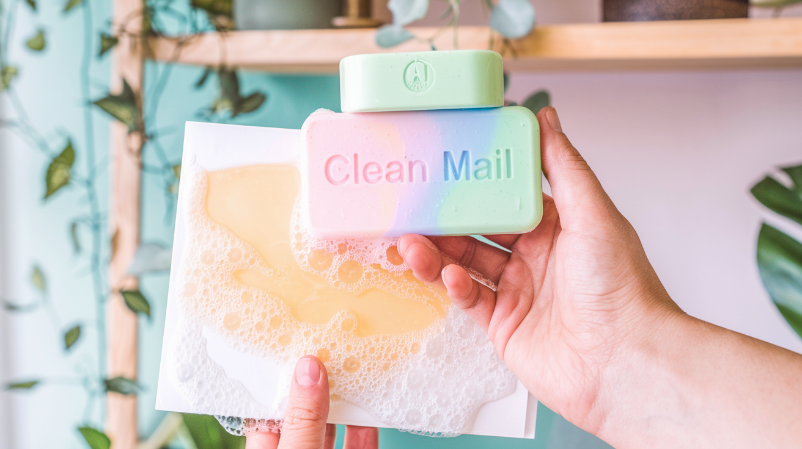

# Email Spam Detection with AI


This project implements an AI-powered email spam detection system using Claude models from Anthropic. It processes emails from an IMAP server, applies whitelist and blacklist filters, and uses AI to classify remaining emails as spam or not.

## Features

- IMAP email processing
- Whitelist and blacklist filtering (including domain-level entries)
- AI-powered spam detection using Claude models
- Metrics gathering for performance analysis
- Batch processing for comparing different AI models
- Nightly automated email cleaning

## Prerequisites

- Python 3.6+
- An Anthropic API key
- Access to an IMAP email server

## Setup

1. Clone this repository:
   ```
   git clone https://github.com/chrisaharden/cleanmail.git
   cd cleanmail
   ```

2. Install required Python packages:
   ```
   pip install -r requirements.txt
   ```

3. Copy `config.json` to create configuration files for each Claude model you want to use:
   ```
   cp config.json config-3.0-Haiku.json
   cp config.json config-3.0-Opus.json
   cp config.json config-3.5-Sonnet.json
   ```

4. Edit each configuration file with your email settings, API key, and desired model:
   - Set `email_address`, `password`, `imap_server`, and `imap_port`
   - Set `ANTHROPIC_API_KEY` to your Anthropic API key
   - Set `AIModel` to the appropriate model name (e.g., "claude-3-haiku-20240307")
   - Adjust `whitelist` and `blacklist` as needed
   - Set `OnlyGatherMetrics` to `true` for performance testing

## Usage

### Gathering Metrics

To compare the performance of different Claude models:

1. Ensure `OnlyGatherMetrics` is set to `true` in all config files.
2. Run the batch processing script:
   ```
   batch-gathermetrics.cmd
   ```
3. Review the results in `./output/metrics_results.txt`.

### Nightly Email Cleaning

To set up automated nightly email cleaning:

1. Edit `cleanmailnightly.cmd` to use your preferred config file.
2. Schedule `cleanmailnightly.cmd` to run nightly using your system's task scheduler.

### Manual Execution

To run the script manually:

```
python main.py <config_file_path>
```

Replace `<config_file_path>` with the path to your desired configuration file.

## File Descriptions

- `main.py`: The main Python script for email processing and spam detection.
- `config.json`: Template configuration file.
- `batch-gathermetrics.cmd`: Batch script for comparing multiple AI models.
- `cleanmailnightly.cmd`: Script for nightly automated email cleaning.
- `analyze_metrics.py`: Script for analyzing performance metrics.

## Output

- Processed emails are moved to the Junk folder if classified as spam.
- Metrics are saved to CSV files in the `./output/` directory.
- Console output is logged to `./output/log.txt` for nightly runs.

## Contributing

Contributions are welcome! Please feel free to submit a Pull Request.

## License

This project is licensed under the MIT License - see the LICENSE file for details.

## Disclaimer

This tool processes emails and makes decisions about spam classification. Use it responsibly and ensure you have the necessary permissions to process emails in your organization.
